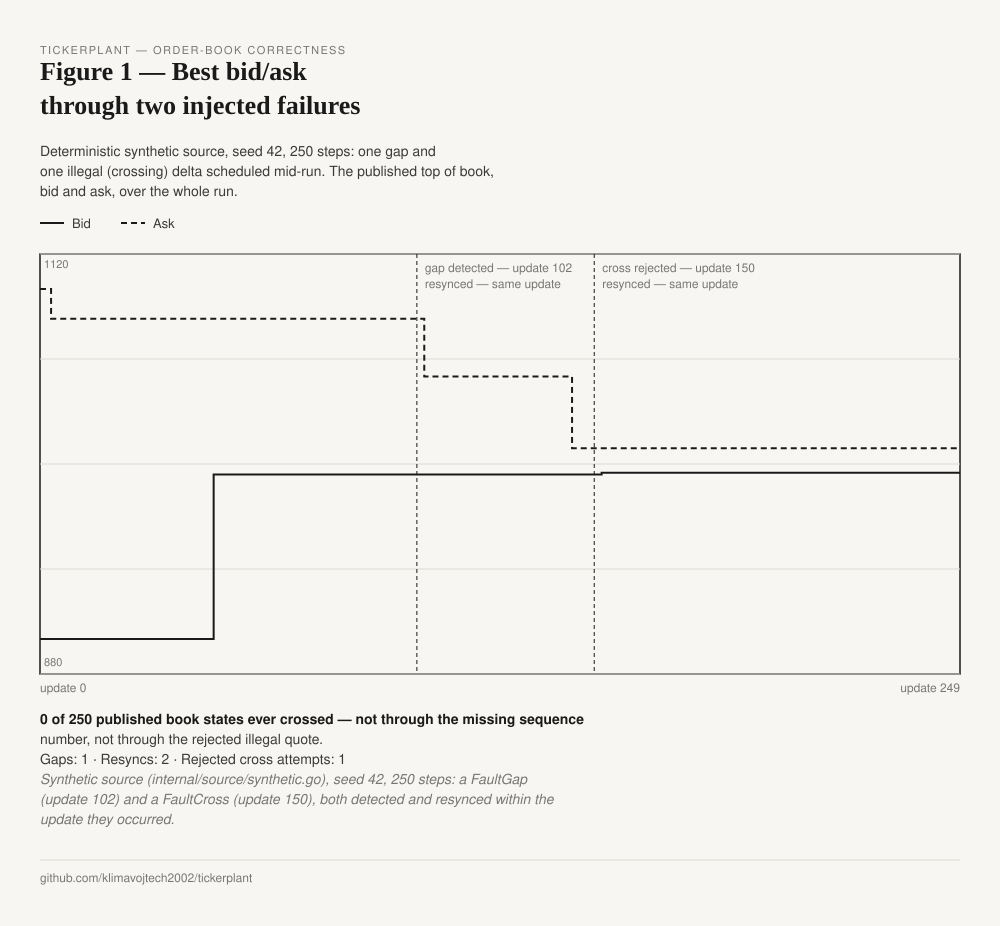
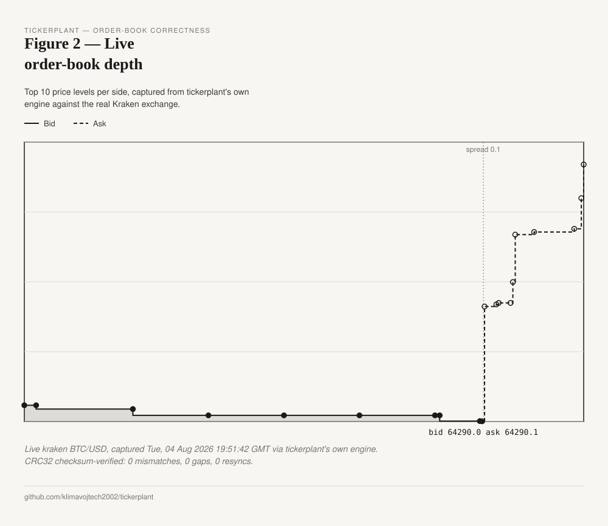
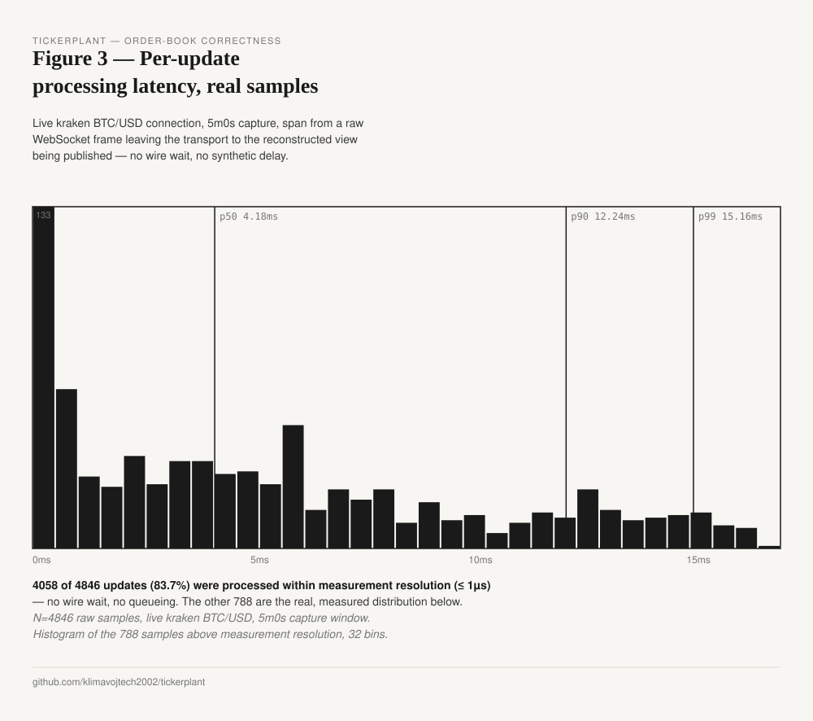

# tickerplant

A real-time service that reconstructs live order books from crypto-exchange feeds, normalizes them
into one canonical stream, and fans that stream out to consumers — with correctness guarantees that
hold under reconnects, sequence gaps, and slow consumers. Binance and Kraken are wired live today
(see Status); the transport port makes a third venue an adapter, not a rewrite.

In plain terms: it connects to an exchange, rebuilds its live order book from a snapshot plus a flood
of incremental updates, and serves a single clean, gap-free view downstream — and it can prove that
view stays correct: no silent loss, duplication, or reordering across reconnects and gaps.

[](https://github.com/klimavojtech2002/tickerplant/actions/workflows/ci.yml)
[](LICENSE)

## The problem

Anyone building on market data needs one reliable, normalized view of it. Each venue speaks a
different WebSocket protocol, sequences updates differently, and disconnects without warning. The
valuable part is not a trading strategy — it's the data layer underneath it.

The hardest piece of that layer is the order book. An exchange sends a snapshot and then a stream of
incremental deltas; you reconstruct the book yourself. Apply a delta across a sequence gap, or
mishandle the snapshot-vs-stream race, and the book silently goes wrong: it crosses (bid at or above
ask), or drifts from reality with no error raised.

## What it does

- Ingests a live order-book feed over WebSocket (Binance and Kraken today; the transport port takes
  any venue).
- Reconstructs the venue's L2 order book from snapshot plus incremental deltas, detecting sequence
  gaps and resynchronizing from a fresh snapshot when one is found.
- Normalizes the venue's heterogeneous format into a single canonical book and trade model.
- Fans the normalized stream out to consumers with backpressure handling.

## Correctness invariants

Checked continuously, not assumed:

- **The book never crosses.** The best bid is always strictly below the best ask. A violation is a
  bug, surfaced immediately, not served downstream.
- **The book stays in sync with the venue.** Where a venue numbers updates, a missing number is a
  gap; where it publishes a checksum instead, a mismatch is the equivalent signal. Either way the book
  doesn't guess — it resynchronizes from a new snapshot, following each exchange's documented recovery
  procedure.

Enforced with property-based tests: generate arbitrary legal and illegal update sequences and assert
the book either stays correct or correctly resyncs. Recovery procedure per venue and the exact
failure model are in [docs/correctness.md](docs/correctness.md).

## Figures

Generated by `tools/figuregen`, which runs the engine and captures what it actually does, rather than
illustrating it after the fact.







## Architecture — a sans-I/O core

The reconstruction and fan-out logic is written against an abstract transport, with no knowledge of
sockets or any specific exchange. Live connections exist only at the edge, as adapters implementing
that transport — so the correctness story is tested deterministically, against recorded and
synthetically generated feeds where every gap, reorder, and disconnect can be reproduced exactly.

```
   exchanges (live)              tickerplant                          consumers
 ┌──────────────────┐      ┌────────────────────────┐
 │ venue A (WS)     │─────►│ ingestion adapters     │
 ├──────────────────┤      │   (transport port)     │
 │ venue B (WS)     │─────►│        │               │      ┌────────────────┐
 ├──────────────────┤      │   normalizer           │─────►│stream consumers│
 │ recorded / synth │─────►│        │               │      ├────────────────┤
 │ (tests, same     │      │   order-book engine    │─────►│live dashboard  │
 │  port)           │      │   (invariant-checked)  │      └────────────────┘
 └──────────────────┘      │        │               │
                           │   fan-out (in-process) │
                           └────────────────────────┘
```

The fan-out is a small in-process broadcaster: the engine publishes a complete, immutable top-of-book
view, and each consumer holds a size-1 latest slot — a lagging consumer jumps to the freshest book
rather than replaying stale ones, and past a bound a consumer that can't keep up is disconnected.

## Design

Each venue's book has exactly one writer goroutine; readers get a consistent view through an
atomically published snapshot, so reads take no lock on the writer's hot path. The reasoning, and the
alternative it was weighed against (a persistent tree for deeper views), is ADR-0008 in
[docs/decisions.md](docs/decisions.md) — 19 decisions total, each with what was considered and
rejected.

## Scope

Narrow and deep on purpose: **two to three venues, reconstructed correctly**, with a fourth venue an
adapter rather than a rewrite.

**Out of scope:** trading and execution (this is the data layer, not a bot); arbitrage capture,
colocation, and MEV infrastructure (capital-intensive and a different problem); crash persistence
(state lives in memory — correctness covers reconnects and gaps for a live process, not surviving a
crash).

## Latency

The engine measures internal processing latency — raw message in, normalized update out of fan-out —
as a measured distribution (p50/p99/p99.9/max) under a defined load harness, reported once measured.
End-to-end latency from the exchange is network round-trip, which this system doesn't control.

## Tech stack

Go, standard library only for the core (model, transport port, engine, fan-out) — one third-party
WebSocket client at the edge (ADR-0014). A Next.js/TypeScript dashboard on top. GitHub Actions runs
CI.

## Running it

```
docker compose up --build
```

Brings up the edge (`:8080`) and the dashboard (`:3000`) together. No account or API key required —
the edge defaults to the deterministic synthetic source. Open `http://localhost:3000`.

For live data instead:

```
docker compose run --rm --service-ports edge -http :8080 -live -venue kraken -symbol BTC/USD
```

Both images are multi-stage: the Go service on `gcr.io/distroless/static-debian12:nonroot` (no shell,
non-root; 15.9 MB), the dashboard as a static export on `nginx:alpine` (74.7 MB).

Without Docker: `go run ./cmd/tickerplant -http :8080 -steps 100000000` for the edge, then
`cd web && pnpm install && pnpm dev` for the dashboard.

## Status

| Component | Status |
|-----------|--------|
| Canonical book/trade model (integer ticks, no float) | Done — tested |
| Per-venue normalization to the canonical model | Done — tested (Binance, Kraken) |
| Order-book engine (snapshot + delta, gap detect, resync, invariants) | Done — tested |
| Transport port + deterministic synthetic source (seeded, fault-injecting) | Done — tested |
| Recorded source (replay captured feeds) | Planned (with adapters) |
| Binance live adapter (WebSocket diff-depth + REST snapshot) | Done — tested (`-live`) |
| Kraken live adapter (WS v2 in-band book + CRC32 drift detection) | Done — tested (`-live -venue kraken -symbol BTC/USD`) |
| OKX live adapter | Planned |
| Fan-out delivery (`internal/delivery`, in-process, bounded backpressure) | Done — tested |
| Runnable demo (`cmd/tickerplant`: source → engine → fan-out) | Done |
| Dashboard (Next.js, `web/`: live book + health from the HTTP edge, no floats on the price path) | Done — tested |
| Metrics: engine counters (gaps/resyncs/disconnects) + latency histogram | Done — tested |
| HTTP edge: SSE `/stream` (complete top-N views) + `/metrics` JSON (`-http :8080`) | Done — tested |
| Benchmark harness (open-loop, coordinated-omission-aware) | Done — tested |
| CI (`.github/workflows/ci.yml`: gofmt / vet / staticcheck / build / `-race`, plus a front-end lint/type-check/test/build job) | Done |
| Docker, docker-compose (`docker compose up`, synthetic by default) | Done — tested |

## Limitations

Market-data infrastructure, not a trading system. Runs single-region against public exchange feeds.
Does not place orders, model risk, or attempt to capture the opportunities it surfaces.

## License

MIT — see [LICENSE](LICENSE).
